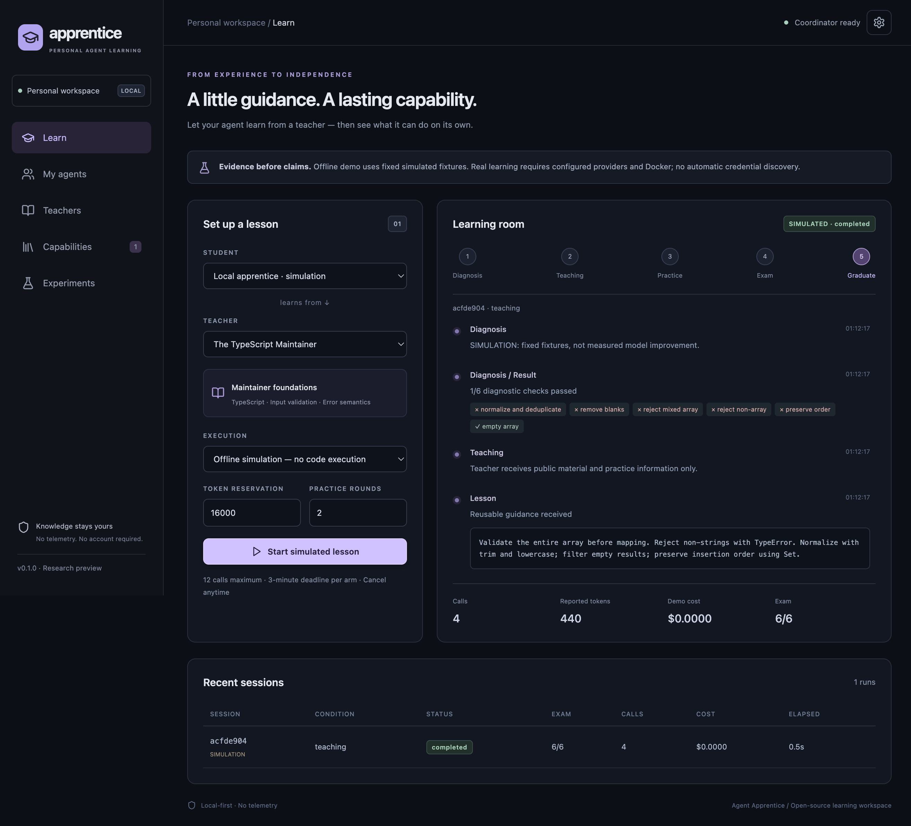

# Agent Apprentice

**Let your personal agent learn from a teacher — then graduate independently.**

[中文](README.zh-CN.md) · [Architecture](docs/ARCHITECTURE.md) · [Security](SECURITY.md) · [Evaluation](docs/EVALUATION.md)

An original, local-first **TypeScript + Electron + React** desktop classroom, with a CLI and versioned teacher API. Connect a student and a teacher, practice with feedback, disconnect the teacher for the exam, and keep an exportable capability record.

> **Research preview, not a claim of AGI or proven transfer.** The bundled offline demo uses deterministic fixtures and is visibly marked **SIMULATED**. No model weights are changed. Real adapters are implemented, but real teaching efficacy must be measured with your explicitly configured models and budget. Passing one narrow task family does not establish general expertise.

## What works



*Actual desktop screenshot of the offline simulation; not a live-model benchmark.*

- Five desktop views: learning room, agents, teachers, capability archive, four-arm experiment comparison.
- Persistent diagnosis → teaching → practice → independent exam lifecycle, cancellation, call/token reservations and deadlines.
- OpenAI Chat Completions, Responses and native Anthropic Messages adapters. Desktop API keys use OS-backed encrypted storage, with explicit environment-variable mode retained for desktop and CLI.
- Authenticated REST/SSE coordinator and opt-in remote teacher protocol.
- Docker-only real TypeScript execution: non-root, no network, read-only source, resource limits, no host credential mounts.
- Capability provenance, conditional verification, checksum, import/export, disable/delete and independent retest.
- No telemetry or automatic credential discovery. No mandatory account or hosted backend.

The Metis CLI adapter is deliberately **disabled**, not advertised as working: its isolated execution path has not yet been independently verified. Public teacher marketplace, payments, automatic fine-tuning and general skill certification are not implemented.

## Run from source

Prerequisites: **Node 22.13+**, **pnpm 11.7**. Development is tested on macOS Apple Silicon. Cross-platform support is not yet certified.

```sh
pnpm install --frozen-lockfile
pnpm rebuild:electron
pnpm build
pnpm start
```

The desktop bundles its runtime; an eventual packaged user does not need Node. Current macOS test packages are unsigned and not notarized. Do not disable system security to run an untrusted build.

Click **Start simulated lesson** to explore the complete product without credentials or Docker. Its displayed improvements are fixtures, not real measurements.

### CLI

```sh
node dist/cli.cjs --help
node dist/cli.cjs demo
node dist/cli.cjs compare
node dist/cli.cjs status
node dist/cli.cjs doctor
```

CLI data defaults to `~/.agent-apprentice`; desktop data defaults to Electron's application-data directory. `APPRENTICE_DATA` overrides either. A directory has one coordinator: the second process fails instead of creating a second scheduler. Connect a CLI to an existing coordinator using `--url` and `APPRENTICE_API_TOKEN`.

## Use real models

1. In **My agents**, select OpenAI Chat Completions, Responses or Anthropic Messages. Use **Connect remote teacher** separately for this project's `/v1/teach` protocol.
2. Enter model ID and base URL; Anthropic supports a root URL or `/v1` and uses native `x-api-key` authentication. Paste the key in **API key (secure storage)**, or select **Environment variable name** and supply a name whose value was set before launch. Optional prices are USD per million tokens; missing prices remain **Unknown**. Saved keys can be replaced in **Edit connection** or removed independently.

The connection dialog displays the actual `userData/credentials.enc.json` path. Keys are encrypted with Electron `safeStorage` (macOS Keychain-backed), written atomically with mode 0600, and bound to the provider ID, protocol and endpoint. Unavailable system encryption fails closed; no plaintext fallback. No shell files, global environment or other applications' configuration are changed. CLI saved-key references require the desktop coordinator; standalone CLI retains environment-variable mode.

3. In **Teachers**, create a teacher profile linked to the teacher provider. Review authorized materials and license.
4. Start Docker and explicitly prepare the exercise image:

```sh
docker pull node:24-alpine
```

5. Select **Real model + isolated Docker execution** and review the transmission consent. Public task text, selected teacher material, generated student attempts and practice feedback go to the configured providers. No private project files are selected.
6. Run a lesson or comparison. All four conditions use the selected student and task budget; teaching overhead is included. Unknown usage remains unknown. Byte-based token reservations are conservative, not exact tokenizer counts or dollar caps.

The current original course is a narrow TypeScript tags-validation library. See [the course](examples/maintainer-course/README.md) and [evaluation limits](docs/EVALUATION.md).

If using Colima or another Docker context, explicitly set the corresponding `DOCKER_HOST` when launching the application. Source and test inputs are streamed over stdin and TypeScript is processed inside the container. No host directory is mounted, and no host-execution fallback exists.

### Colima instead of Docker Desktop

Docker Desktop is not required. Colima with the **Docker runtime** supplies the engine; the `docker` CLI is still required. Colima's containerd runtime, Podman and native host execution are not currently validated backends.

Run `colima list` and `docker context ls` to find your running profile and context. The example below uses `colima` (the default profile); replace it with the context for your profile. These commands do not change the global Docker context:

```sh
# For a new default profile only, if no suitable Docker profile is running:
# colima start --runtime docker
COLIMA_HOST="$(docker context inspect colima --format '{{.Endpoints.docker.Host}}')"
DOCKER_HOST="$COLIMA_HOST" docker pull node:24-alpine
DOCKER_HOST="$COLIMA_HOST" pnpm start
```

Quit an already running desktop instance before relaunching. For a locally built macOS arm64 package, replace `pnpm start` with `"./release/mac-arm64/Agent Apprentice.app/Contents/MacOS/Agent Apprentice"`. Check **Settings → Refresh environment**; a Finder launch does not necessarily inherit a terminal's `DOCKER_HOST`. Offline simulation needs neither Colima nor Docker.

## Remote teaching

Generate two distinct random tokens: `APPRENTICE_API_TOKEN` for your administrator CLI, and `APPRENTICE_TEACHER_TOKEN` for students. Never give students the administrator token. Then:

```sh
node dist/cli.cjs serve --port 4318 --teacher-provider my-teacher
node dist/cli.cjs --url http://127.0.0.1:4318 status
```

The service binds only to loopback. Remote deployment requires your authenticated HTTPS reverse proxy; expose only `/v1/teach` and preserve a loopback Host accepted by the service. The teaching credential cannot access administration or events. Teaching is capped at 100 lifetime attempts, two concurrent calls, 30 seconds/call, 600 requested output tokens/call, and a finite lifetime reservation budget; CLI flags can lower limits. There is no unauthenticated public discovery. See [protocol](docs/PROTOCOL.md) for exact limits and permission boundaries.

## Development and verification

```sh
pnpm typecheck
pnpm lint
pnpm test
pnpm build
pnpm rebuild:electron
pnpm test:e2e
APPRENTICE_TEST_DOCKER=1 pnpm test
pnpm pack:dir
pnpm smoke:packaged
```

Docker tests are explicitly gated and report skipped when not enabled. They test actual execution/isolation, not teaching quality. Electron and Node have separate SQLite copies because their native ABIs differ; `scripts/rebuild-electron.mjs` rebuilds only the Electron copy. Run it again after dependency reinstalls. Do not use an unscoped `electron-rebuild` across both copies.

## Open source

Apache-2.0 for this original implementation and course. Dependencies retain their own licenses. Agent Teams AI inspired the desktop/runtime separation; no AGPL source or assets were copied. Teaching materials and model access must be independently authorized. See [contributing](CONTRIBUTING.md).
